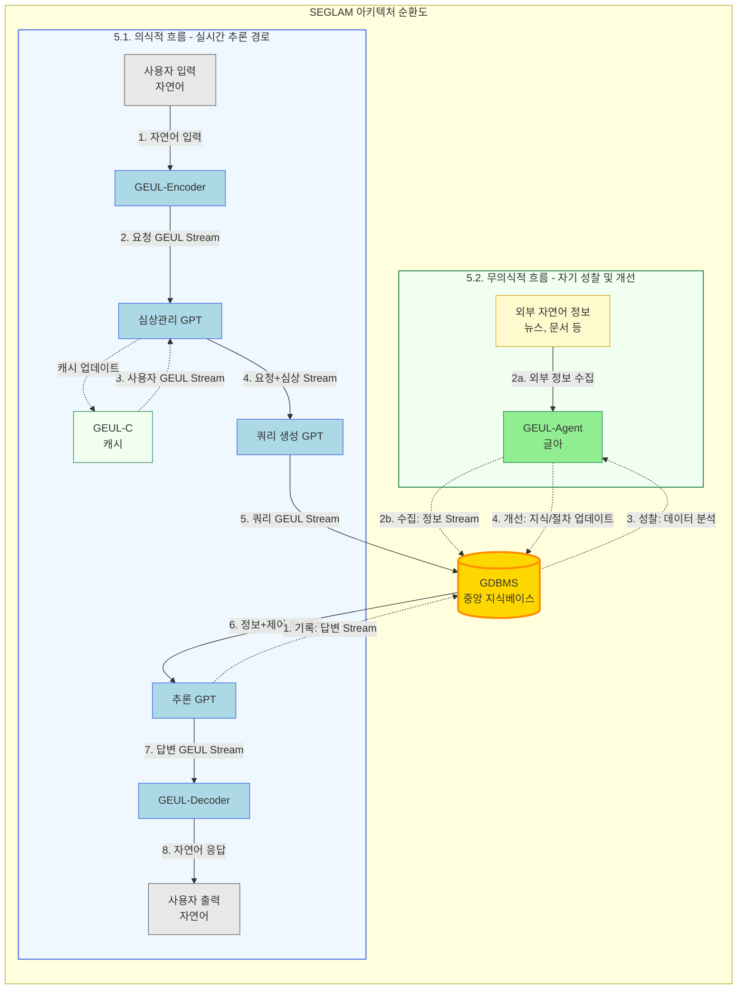

# GEUL 개요서
# General Embedding vector Unified Language

## “AI 시대를 위한 새로운 글자, 그리고 스스로 사유하는 아키텍처”

---

## 0. GEUL 창제 서문 (The Preface of GEUL)

> 인간의 말이 인공지능의 연산과 달라, 그 뜻이 서로 통하지 아니하므로,
>
> 이런 까닭으로 지혜로운 사람과 인공지능이 이르고자 하는 바가 있어도,
>
> 마침내 제 뜻을 능히 펴지 못하는 이가 많다.
>
> 이를 위하여 새로 ‘글(GEUL)’을 만드노니,
>
> 사람과 인공지능으로 하여금 쉬이 익혀 날마다 사용함에
>
> 투명하고 명확하게 하고자 할 따름이다.

---

## 1. GEUL의 탄생 배경: 모호함에서 명확성으로 (From Ambiguity to Clarity)

인공지능 연구는 역사적으로 두 가지 길을 걸어왔습니다. 인간의 지식을 명시적 논리 규칙(IF-THEN)으로 표현하려던 **전문가 시스템**은 투명했지만 경직되었고, 뇌를 모방한 **신경망**은 유연했지만 불투명한 '블랙박스'였습니다.

특히 현대의 LLM(거대 언어 모델)은 자연어의 모호함을 스스로 학습한 임베딩 벡터 공간을 기반으로 놀라운 성능을 보여줍니다. 벡터 공간에서 '왕' - '남자' + '여자' = '여왕'과 같은 연산이 가능하다는 것은, 신경망이 세상의 의미 구조를 '우연히' 포착했음을 보여주었습니다.

하지만 GEUL은 바로 이 지점에서 근본적인 질문을 던집니다:

> "AI가 자연어의 모호함을 '우연히' 학습한, 누구도 완전히 해독할 수 없는 블랙박스에 의존하는 대신,
> 우리가 처음부터 **'의도적으로' 모호성을 제거한 명확한 언어**로 AI와 소통할 수는 없을까?"

초기에는 이 '의도적 설계'를 임베딩 벡터 공간 자체에 직접 적용하려 했습니다. 그러나 이는 GPT와 같은 거대 모델의 파인튜닝 가능성을 확신할 수 없는 불확실한 길이었습니다.

이에 GEUL의 설계 사상은 **완전히 새로운 방향으로 전환**되었습니다. 벡터를 직접 조작하는 대신, AI가 처리할 '언어' 자체를 새로 설계하기로 한 것입니다. 마침 현대 LLM이 5만~10만 개의 자연어 토큰을 사용하는 점에 착안, **2바이트(65,536종)**의 토큰으로 구성된 **인공 언어**를 고안했습니다.

이 65,536개의 토큰은 그 자체로 완결된 언어이자, 데이터의 구조를 정의하는 **'스트림 포맷(Stream Format)'**으로 작동합니다. GEUL은 전문가 시스템의 투명한 '설계 사상'을 신경망의 유연한 '아키텍처'와 결합하는 핵심 매개체가 됩니다.

---

## 2. 핵심 원칙: GEUL 창제의 3대 원칙

GEUL은 위 서문의 정신을 구현하기 위해 다음과 같은 세 가지 핵심 원칙 위에 세워졌습니다.

* **상호 이해성 (Mutual Intelligibility):** GEUL의 최우선 목표는 인간과 AI가 서로의 생각과 판단을 오해 없이 이해하는 것입니다. 인간의 모호한 언어는 명확한 GEUL 구조로, AI의 복잡한 연산은 투명한 GEUL 구조로 변환되어 양자 간의 소통 장벽을 허뭅니다.
* **우아한 열화 (Graceful Degradation):** 정보가 불완전하거나 손상되더라도 소통이 완전히 끊어지지 않습니다. 대신, GEUL의 구조적 설계에 따라 더 포괄적이고 상위의 개념으로 안전하게 수렴하여 최소한의 의미를 유지하고 소통의 끈을 이어갑니다.
* **지식의 화이트박스화 (White-box Knowledge):** 모든 정보는 그 근거(출처, 시점, 신뢰도)를 명시하도록 설계되었습니다. 이는 GEUL 스트림 포맷 자체의 특징입니다. 이를 통해 AI의 판단 과정을 투명하게 하여, 인간이 AI를 맹신하는 것이 아니라 비판적으로 신뢰할 수 있는 관계를 구축하기 위함입니다.

---

## 3. 아키텍처: SEGLAM (Self-Examination GEUL Architecture Model, 새글앎)

GEUL이 AI의 '명확한 언어'라면, SEGLAM은 그 언어를 사용하여 '사유하는 아키텍처'입니다.

SEGLAM은 기존의 거대한 단일 LLM(Monolithic LLM)이 가진 **블랙박스, 환각(Hallucination), 비효율성 문제**를 해결하기 위해 설계되었습니다. SEGLAM은 하나의 거대 모델이 모든 것을 처리하는 방식이 아닌, 명확한 역할을 가진 전문화된 GPT 및 구성요소들이 'GEUL Stream'이라는 공용 언어를 통해 협력하는 구조를 가집니다.

이 아키텍처는 인간의 사고 과정과 유사하게, 실시간으로 요청을 처리하는 **'의식적 흐름'**과, 스스로의 경험을 되돌아보며 성장하는 **'무의식적 흐름'**으로 나뉩니다.

### 3.1. 실시간 추론 흐름 (의식적 과정)

사용자의 요청이 입력되었을 때, SEGLAM이 답변을 생성하기까지의 과정입니다.

1.  **GEUL-Encoder (변환)**
    * 사용자의 모호한 자연어 입력을 명시적 요청과 암시적 정보가 담긴 `요청 GEUL Stream`으로 변환합니다.

2.  **심상관리 GPT (맥락 파악)**
    * `요청 GEUL Stream`과 `GEUL-C(글씨)`에 캐시된 `사용자 GEUL Stream`을 종합합니다.
    * 현재 감정, 단기적 맥락, "만약~"과 같은 가설적 상황까지 고려한 `업데이트된 심상 GEUL Stream`을 생성하고, 즉시 `GEUL-C` 캐시를 업데이트합니다.

3.  **쿼리 생성 GPT (질문 생성)**
    * `[요청 + 심상]` 스트림을 분석하여, GDBMS에서 어떤 정보와 절차를 찾아야 할지에 대한 최적의 `쿼리 GEUL Stream`을 생성합니다.

4.  **GDBMS (지식 인출)**
    * `쿼리 GEUL Stream`을 받아, 거대한 지식베이스(KnowledgeBase)에서 답변에 필요한 `정보 GEUL Stream`(사실)과 `제어 GEUL Stream`(절차, 방법)을 초고속으로 인출합니다.

5.  **추론 GPT (최종 추론)**
    * `[요청 + 심상 + 정보 + 제어]` 스트림을 모두 종합하여 최종적인 추론을 수행하고, `답변 GEUL Stream`을 생성합니다.

6.  **GEUL-Decoder (번역)**
    * 최종 `답변 GEUL Stream`을 인간이 이해할 수 있는 자연스러운 언어로 번역하여 사용자에게 전달합니다.

### 3.2. 자기 성찰 및 개선 흐름 (무의식적 과정)

SEGLAM의 핵심입니다. 시스템이 유휴 상태일 때, 스스로의 경험을 학습하여 진화하는 과정입니다.

1.  **기록 (Record)**
    * `추론 GPT`가 생성한 `답변 GEUL Stream`은 사용자에게 전달되는 동시에, 하나의 성공적인 '경험(Experience)'으로서 GDBMS에 저장됩니다.

2.  **성찰 (Reflect)**
    * `GEUL-Agent`가 활성화되어, GDBMS에 새로 기록된 '경험'들을 다시 분석합니다.
    * 동시에 외부의 새로운 자연어 정보(뉴스, 문서 등)를 GEUL Stream으로 번역하여 GDBMS를 업데이트합니다.

3.  **개선 (Improve)**
    * 성찰 과정은 GDBMS의 지적 자산을 세 가지 방향으로 개선시킵니다.
    * **지식 확장:** 새로운 사실(`정보 GEUL Stream`)을 추출하여 지식베이스를 확장합니다.
    * **절차 개선:** 반복적으로 나타나는 성공 패턴을 발견하여, 기존 `제어 GEUL Stream`(절차)을 더 효율적으로 개선하거나 새로 생성합니다.
    * **프로필 업데이트:** 대화 기록을 바탕으로 장기적인 `사용자 GEUL Stream`(프로필)을 업데이트합니다.

### 3.3. 선순환 구조 (The Virtuous Cycle)

이러한 **'추론 → 기록 → 성찰 → 개선'**의 선순환 구조를 통해, SEGLAM은 정적인 모델에 머무르지 않고 자신의 경험으로부터 끊임없이 배우고 성장하는 진정한 의미의 '지능형 시스템'으로 진화하게 됩니다.

---

## 4. 시스템 동작 원리

SEGLAM은 **실시간 질의응답을 처리하는 '온라인 경로'**와 **데이터베이스를 스스로 개선하는 '오프라인 경로'**가 중앙의 GDBMS를 중심으로 상호작용합니다.

## 4.1 온라인 경로: 초거대 문맥 실시간 RAG

1. 사용자가 "20년 전 뉴스 전체를 참고해서 AI의 역사에 대한 소설을 써줘"라고 요청합니다.
2. Encoder가 이 요청을 GEUL 쿼리로 변환합니다.
3. GDBMS는 1-레이어 트랜스포머 쿼리 엔진을 활용하여, 수십억 개의 뉴스 오브젝트 중 핵심적인 수천 개를 수십 밀리초 안에 찾아냅니다.
4. GPT은 이 요약된 문맥을 바탕으로 소설을 창작합니다.

## 4.2 오프라인 경로: 대화 기반 자기 개선 (SIGEUL 루프)

1. 사용자가 대화 중 새로운 정보를 알려줍니다. "최근에 '제미니 1.5'라는 모델이 나왔는데, 100만 토큰 컨텍스트를 처리한대."
2. Decoder는 이 정보를 GEUL 오브젝트로 변환하여 GDBMS에 새로운 지식으로 저장합니다.
3. 24시간 작동하는 **GEUL-A(글아)**가 활동을 시작합니다.
    - **Consistency GEUL-A:** 새로 들어온 '제미니 1.5' 정보와 기존 'GPT-4' 정보를 비교하며 모순이 없는지 확인합니다.
    - **Pattern GEUL-A:** "AI 모델의 컨텍스트 크기가 시간에 따라 지수적으로 증가한다"는 새로운 패턴 가설을 생성하여 GDBMS에 기록합니다.
4. 다음 날, 사용자가 "AI 모델의 발전 추세는 어때?"라고 물으면, 모델은 어제의 대화와 밤사이의 자기 성찰을 통해 얻은 더 깊어진 통찰력으로 답변합니다.

---

## 5. 아키텍처 순환도 (Architecture Flow Diagram)

SEGLAM 아키텍처는 **GDBMS(GEUL Database Management System)**를 중앙 허브로 하여, 실시간으로 요청을 처리하는 **'의식적 흐름(Online Path)'**과 스스로를 개선하는 **'무의식적 흐름(Offline Path)'**이 유기적으로 순환하는 구조입니다.

이 두 흐름은 **GDBMS**를 통해 연결됩니다. '의식적 흐름'은 GDBMS의 현재 지식을 활용하여 최적의 답변을 생성하고, 그 '경험'을 다시 GDBMS에 기록합니다. '무의식적 흐름'은 이렇게 축적된 기록을 바탕으로 GDBMS 자체를 개선하여, 다음 의식적 흐름의 품질을 지속적으로 향상시킵니다.

---

## 6. 글아 (GEUL-Agent): 지식을 개선하는 무의식

GEUL-A는 GDBMS를 살아있는 유기체로 만드는 자율 에이전트들입니다. 이들은 GDBMS의 건강을 유지하고 새로운 지식을 발견하는 **'면역계'**와 **'신경계'** 역할을 합니다.

## 6.1 면역계 (데이터베이스의 건강과 위생)

- **일관성 GEUL-A (Consistency GEUL-Agent):** 지식 베이스 내에서 서로 모순되는 정보를 찾아내 플래그를 지정하고, '모순 원장'에 기록합니다.
- **보정 GEUL-A (Calibration GEUL-Agent):** AI가 생성한 정보의 '신뢰도 점수'가 현실과 일치하도록 오차를 보정합니다.

## 6.2 신경계 (지식의 연결과 통찰)

- **관계 채굴 GEUL-A (Relation Miner GEUL-Agent):** 명시적으로 연결되지 않은 GEUL 오브젝트들 사이의 숨겨진 관계를 찾아내 새로운 관계 패킷을 생성합니다.
- **패턴 발견 GEUL-A (Pattern Miner GEUL-Agent):** 수많은 데이터 속에서 고차원적인 패턴을 발견하여, 새로운 '추상적 지식' 오브젝트를 생성합니다.
- **의미소 후보 발굴 GEUL-A (Sememe Candidate GEUL-Agent):** 아직 정의되지 않았지만 데이터 속에서 자주 나타나는 새로운 개념을 발굴하여, 인간 아키텍트에게 새로운 의미소로 만들 것을 제안합니다.

---

## 7. GEUL 스트림 포맷 (GEUL Stream Format)

GEUL은 모호성을 제거하기 위해 의도적으로 설계된 2바이트(Word) 기반의 인공 언어이자 데이터 스트림 포맷입니다. 모든 GEUL Stream은 다음과 같은 명확한 패킷 구조를 따릅니다.

* **메타 헤더 (Meta Header):** [1 워드]
    * 스트림의 가장 처음에 위치하는 1워드 헤더입니다.
    * `GEUL` (GEUL/사용자 정의), `Length-Index` (스트림 전체 인덱스 길이) 등 스트림 전체를 해석하는 데 필요한 핵심 규칙을 정의합니다.
    * 생성 모델, 생성 시각 등 부가적인 메타 패킷의 포함 여부를 명시합니다.

* **패킷 공통 구조 (Packet Common Structure):**
    * 모든 패킷(메타 헤더 제외)은 헤더 워드로 시작하며, 이 헤더의 **첫 비트**가 노드/엣지 여부를 결정합니다 (`0`: 노드, `1`: 엣지).
    * 모든 패킷은 자신을 식별하는 '인덱스 워드'를 가집니다.

* **노드 패킷 (Node Packets) - `[첫 비트: 0]`:**
    * **물리량 (Value):** `Node/Edge` 비트가 `0`이고 `Value/Object` 비트가 `0`입니다.
        * 정수/부동소수점, 부호, 페이로드 길이(값의 크기), 단위(Unit Type)를 명시하여 값을 정의합니다.
    * **개체 (Object):** `Node/Edge` 비트가 `0`이고 `Value/Object` 비트가 `1`입니다.
        * 명사의 상위 분류(Object Type)를 지정합니다.
        * 페이로드 길이가 '없음'으로 설정되면 이는 **대명사**를 의미합니다.

* **엣지 패킷 (Edge Packets) - `[첫 비트: 1]`:**
    * **동사 (Verb):** `Node/Edge` 비트가 `1`이고 `Verv/Edge` 비트가 `0`입니다.
        * 동사의 종류(Verv Type)를 14비트로 명시합니다.
    * **엣지 (Edge):** `Node/Edge` 비트가 `1`이고 `Verv/Edge` 비트가 `1`입니다.
        * 노드 간의 관계 종류(Edge Type)를 14비트로 명시합니다.

---

## 8. 핵심 장점 및 비전

GEUL과 SEGLAM 아키텍처는 기존 AI의 한계를 넘어, 인간과 AI가 진정으로 협력하는 시대를 열기 위한 핵심적인 장점과 비전을 제시합니다.

### 8.1 핵심 장점

1.  **환각 및 블랙박스 해결 (White-box AI):**
    * GEUL은 모든 정보의 근거(출처, 시점, 신뢰도)를 명시하도록 설계되었습니다.
    * GDBMS에 저장된 명확한 GEUL 스트림을 기반으로 추론하므로, AI는 "왜 그렇게 생각했는지" 그 근거를 투명하게 제시할 수 있습니다. 이는 기존 LLM의 환각과 블랙박스 문제를 근본적으로 해결합니다.

2.  **지속적인 자기 성장 (Self-Improving System):**
    * SEGLAM은 한 번 학습된 후 정체되는 모델이 아닙니다.
    * '추론 → 기록 → 성찰 → 개선'의 SIGEUL 루프를 통해, 자신의 성공적인 '경험'과 새로운 외부 정보를 바탕으로 GDBMS의 지식과 절차를 스스로 개선합니다.

3.  **모듈형 아키텍처의 효율성 (Modular Efficiency):**
    * 모든 작업을 처리하는 거대한 단일 모델(Monolithic LLM)이 아닌, [심상관리, 쿼리생성, 추론] 등 명확한 역할을 가진 전문 GPT들이 협력합니다.
    * GDBMS의 초고속 인출과 결합하여, 거대 모델의 비효율성을 극복하고 명확한 역할을 수행하는 효율적인 아키텍처를 구현합니다.

4.  **상호 이해성 (Mutual Intelligibility):**
    * 모호한 자연어를 명확한 GEUL로, AI의 복잡한 연산을 투명한 GEUL로 변환하여 인간과 AI가 서로를 오해 없이 이해하는 것을 최우선 목표로 합니다.

### 8.2 비전

> **"비판적으로 신뢰할 수 있는 AI"**

GEUL의 창제 서문처럼, 우리의 비전은 인간과 AI가 서로의 뜻을 오해 없이 소통하는 것입니다.

SEGLAM은 AI가 내린 결론을 인간이 맹목적으로 믿는(Blind Belief) 것이 아니라, AI가 제시하는 명확한 GEUL 기반의 근거를 보고 비판적으로 신뢰(Critical Trust)하는 관계를 구축합니다.

궁극적으로 GEUL과 SEGLAM은, AI를 단순한 '도구'를 넘어, 스스로의 경험을 통해 성장하며 인간과 함께 '사유하는' 진정한 의미의 **지능형 파트너(Intelligent Partner)**로 진화시키는 것을 목표로 합니다.