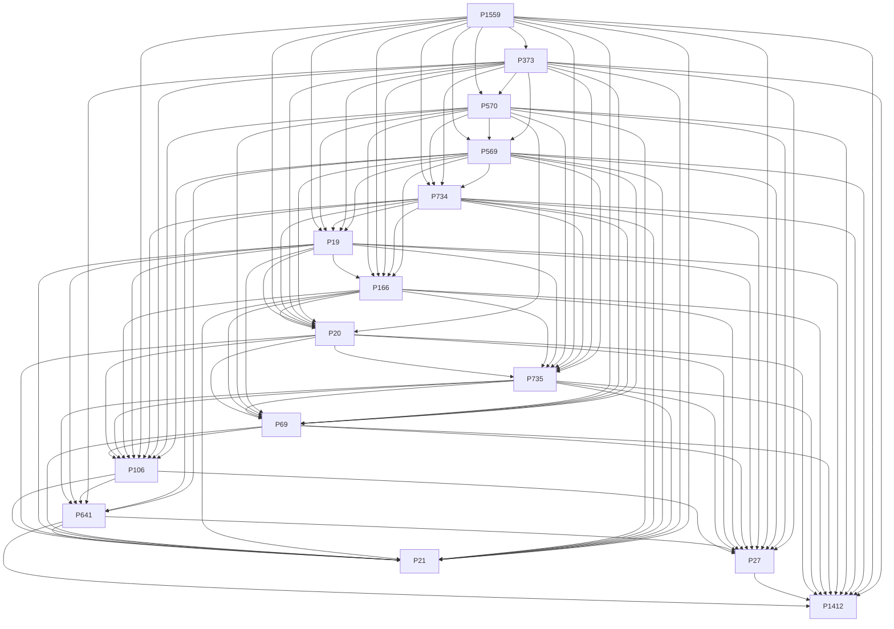
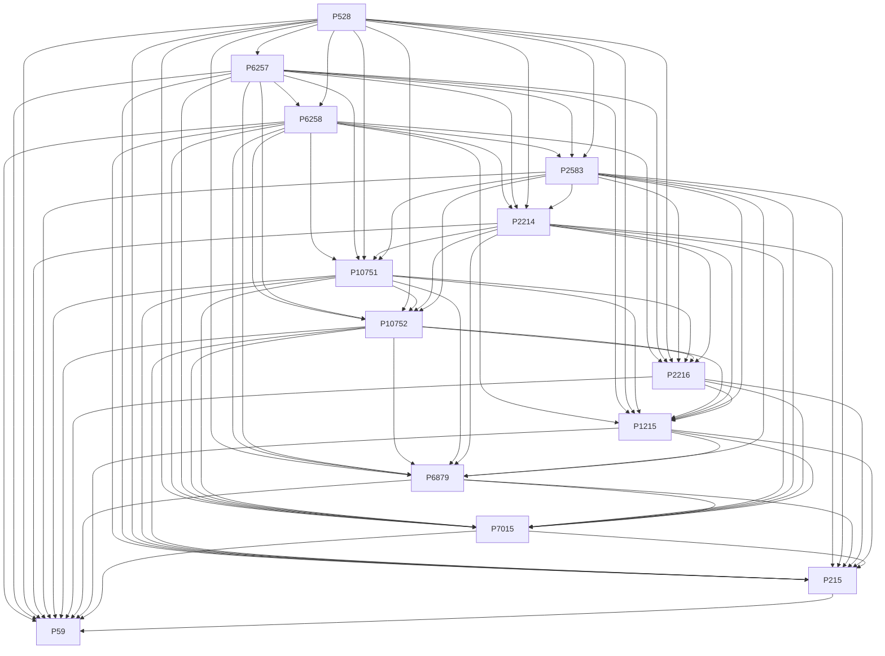
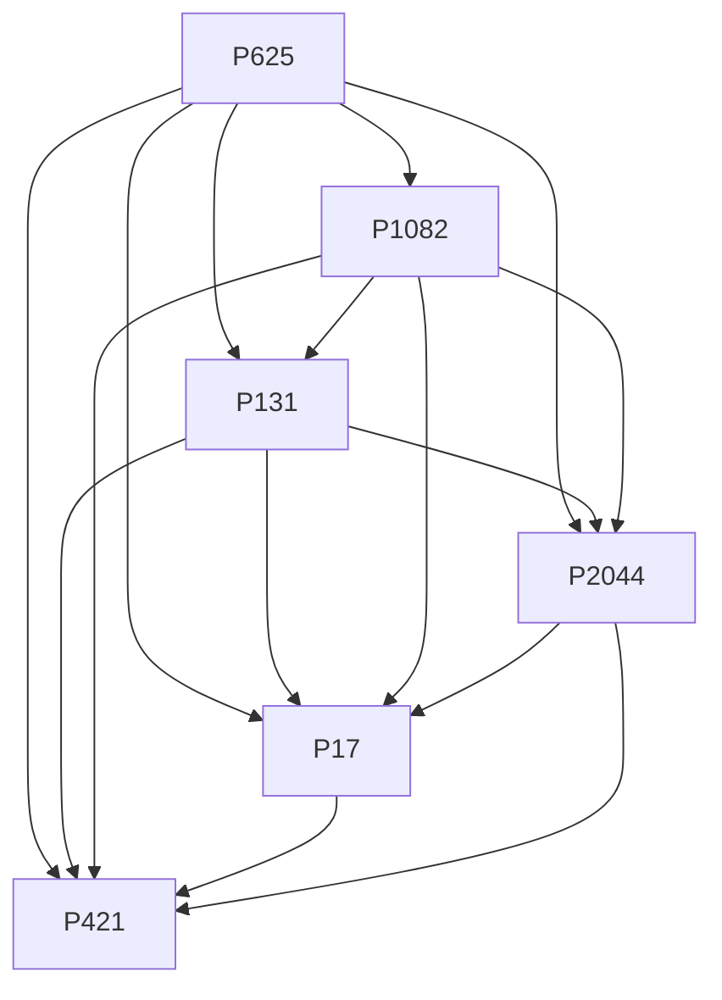
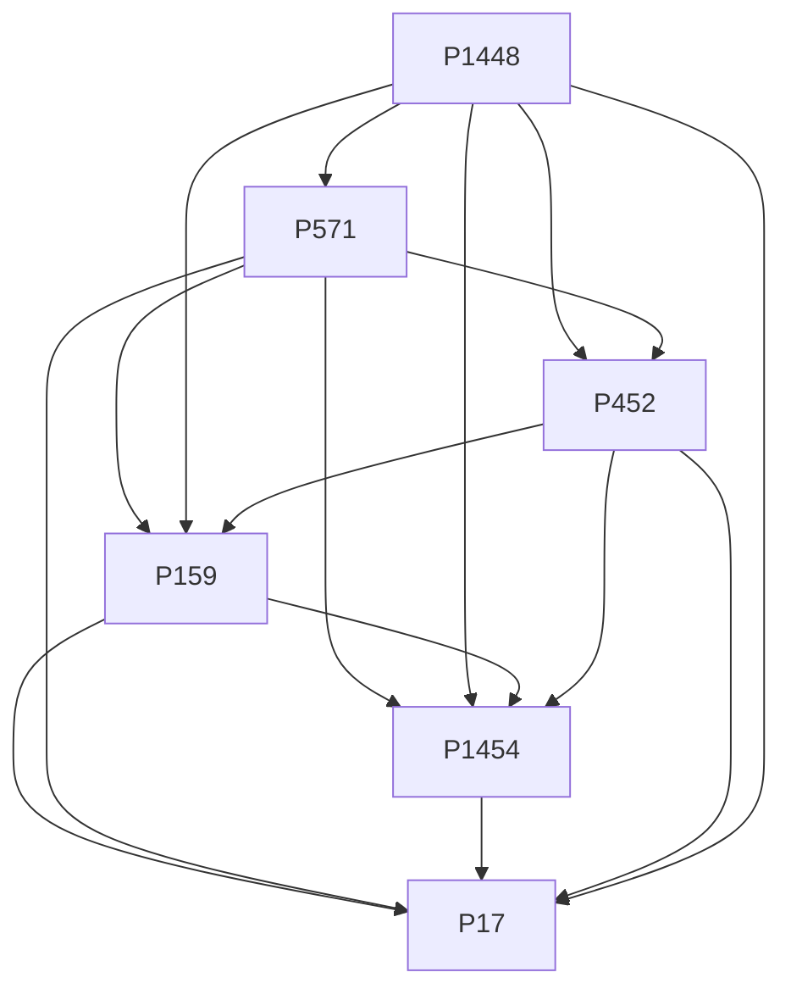
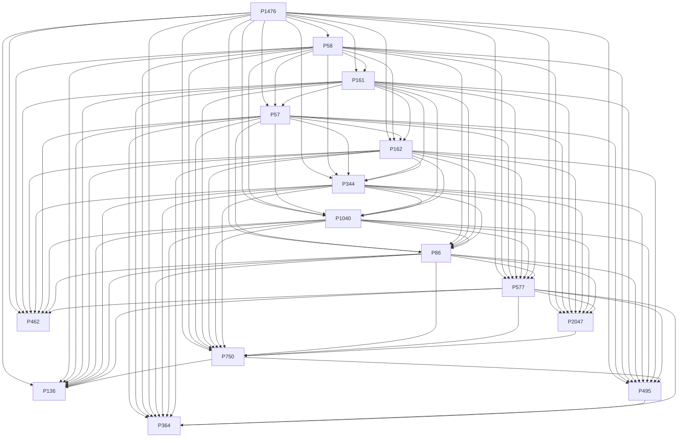

# Stage 2: 계층 의존성 탐지 보고서

**Generated:** 2026-02-01 02:01:53

## 요약

분석 타입: 5개
총 종속 관계: 298개

---

## 인간 (0x00)

### 종속 관계 DAG

| Parent | Child | MI | NMI | H(C|P) |
|--------|-------|----|----|--------|
| P569 | P734 | 10.485 | 0.739 | 0.047 |
| P373 | P569 | 10.303 | 0.703 | 0.000 |
| P570 | P569 | 10.271 | 0.712 | 0.033 |
| P373 | P734 | 9.994 | 0.705 | 0.000 |
| P570 | P734 | 9.869 | 0.696 | 0.030 |
| P1559 | P569 | 9.823 | 0.699 | 0.000 |
| P373 | P570 | 9.729 | 0.675 | 0.000 |
| P1559 | P734 | 9.523 | 0.678 | 0.000 |
| P1559 | P373 | 9.422 | 0.670 | 0.000 |
| P569 | P19 | 9.350 | 0.764 | 0.054 |
| P1559 | P570 | 9.322 | 0.663 | 0.000 |
| P373 | P19 | 9.117 | 0.745 | 0.000 |
| P734 | P19 | 9.067 | 0.741 | 0.172 |
| P570 | P19 | 8.852 | 0.723 | 0.033 |
| P569 | P735 | 8.835 | 0.800 | 0.058 |
| P373 | P735 | 8.631 | 0.782 | 0.000 |
| P734 | P735 | 8.624 | 0.781 | 0.187 |
| P1559 | P19 | 8.593 | 0.702 | 0.000 |
| P1559 | P735 | 8.321 | 0.754 | 0.000 |
| P569 | P166 | 8.272 | 0.711 | 0.023 |
| P570 | P20 | 8.185 | 0.774 | 0.025 |
| P569 | P20 | 8.174 | 0.773 | 0.036 |
| P734 | P166 | 8.133 | 0.699 | 0.086 |
| P373 | P166 | 8.121 | 0.698 | 0.000 |
| P570 | P735 | 8.062 | 0.730 | 0.029 |
| P373 | P20 | 7.933 | 0.750 | 0.000 |
| P734 | P20 | 7.867 | 0.744 | 0.154 |
| P569 | P69 | 7.849 | 0.689 | 0.021 |
| P734 | P69 | 7.760 | 0.682 | 0.078 |
| P1559 | P166 | 7.752 | 0.666 | 0.000 |
| P373 | P69 | 7.730 | 0.679 | 0.000 |
| P570 | P166 | 7.631 | 0.656 | 0.018 |
| P1559 | P20 | 7.631 | 0.722 | 0.000 |
| P19 | P735 | 7.404 | 0.671 | 1.452 |
| P19 | P166 | 7.278 | 0.625 | 0.993 |
| P1559 | P69 | 7.246 | 0.637 | 0.000 |
| P19 | P69 | 7.102 | 0.624 | 0.744 |
| P570 | P69 | 7.058 | 0.620 | 0.004 |
| P166 | P735 | 7.047 | 0.638 | 1.157 |
| P19 | P20 | 7.044 | 0.666 | 1.132 |
| P166 | P69 | 6.738 | 0.592 | 0.731 |
| P569 | P106 | 6.595 | 0.859 | 0.065 |
| P570 | P106 | 6.491 | 0.845 | 0.032 |
| P735 | P69 | 6.450 | 0.584 | 1.393 |
| P373 | P106 | 6.440 | 0.839 | 0.000 |
| P734 | P106 | 6.412 | 0.835 | 0.181 |
| P166 | P20 | 6.207 | 0.587 | 1.172 |
| P20 | P735 | 6.126 | 0.579 | 1.902 |
| P1559 | P106 | 5.940 | 0.774 | 0.000 |
| P20 | P69 | 5.797 | 0.548 | 1.226 |
| P19 | P106 | 5.305 | 0.691 | 1.320 |
| P166 | P106 | 5.187 | 0.676 | 0.989 |
| P735 | P106 | 4.803 | 0.626 | 1.838 |
| P20 | P106 | 4.698 | 0.612 | 1.766 |
| P569 | P641 | 4.583 | 1.003 | 0.013 |
| P734 | P641 | 4.545 | 0.995 | 0.015 |
| P69 | P106 | 4.543 | 0.592 | 1.512 |
| P373 | P27 | 4.476 | 0.794 | 0.000 |
| P373 | P641 | 4.474 | 0.979 | 0.000 |
| P106 | P641 | 4.356 | 0.954 | 0.240 |
| P19 | P641 | 4.346 | 0.952 | 0.239 |
| P735 | P641 | 4.312 | 0.944 | 0.276 |
| P570 | P27 | 4.146 | 0.736 | 0.024 |
| P569 | P27 | 4.135 | 0.734 | 0.043 |
| P1559 | P27 | 4.076 | 0.723 | 0.000 |
| P734 | P27 | 3.907 | 0.693 | 0.104 |
| P19 | P27 | 3.716 | 0.659 | 0.419 |
| P69 | P27 | 3.506 | 0.622 | 0.667 |
| P166 | P27 | 3.445 | 0.611 | 0.444 |
| P20 | P27 | 3.330 | 0.591 | 0.814 |
| P735 | P27 | 3.027 | 0.537 | 1.038 |
| P373 | P1412 | 2.396 | 0.631 | 0.000 |
| P1559 | P1412 | 2.224 | 0.586 | 0.000 |
| P569 | P1412 | 2.171 | 0.572 | 0.026 |
| P734 | P1412 | 2.022 | 0.533 | 0.023 |
| P570 | P1412 | 2.006 | 0.528 | 0.014 |
| P19 | P1412 | 1.992 | 0.525 | 0.168 |
| P641 | P27 | 1.950 | 0.427 | 2.218 |
| P69 | P1412 | 1.925 | 0.507 | 0.316 |
| P166 | P1412 | 1.915 | 0.504 | 0.231 |
| P106 | P27 | 1.824 | 0.324 | 2.345 |
| P735 | P1412 | 1.788 | 0.471 | 0.320 |
| P20 | P1412 | 1.731 | 0.456 | 0.262 |
| P27 | P1412 | 1.661 | 0.438 | 0.512 |
| P641 | P1412 | 1.201 | 0.316 | 1.541 |
| P1559 | P21 | 0.657 | 1.027 | 0.000 |
| P373 | P21 | 0.645 | 1.009 | 0.000 |
| P735 | P21 | 0.616 | 0.964 | 0.002 |
| P569 | P21 | 0.614 | 0.960 | 0.013 |
| P734 | P21 | 0.571 | 0.892 | 0.045 |
| P570 | P21 | 0.458 | 0.717 | 0.002 |
| P166 | P21 | 0.455 | 0.711 | 0.141 |
| P69 | P21 | 0.401 | 0.627 | 0.132 |
| P19 | P21 | 0.393 | 0.615 | 0.233 |
| P641 | P21 | 0.285 | 0.446 | 0.402 |
| P20 | P21 | 0.271 | 0.424 | 0.189 |
| P106 | P21 | 0.225 | 0.352 | 0.401 |

---

## 항성 (0x0C)

### 종속 관계 DAG

| Parent | Child | MI | NMI | H(C|P) |
|--------|-------|----|----|--------|
| P6257 | P6258 | 10.928 | 0.701 | 0.000 |
| P528 | P6258 | 10.922 | 0.700 | 0.000 |
| P528 | P6257 | 10.922 | 0.700 | 0.000 |
| P6258 | P10751 | 10.753 | 0.765 | 0.001 |
| P6257 | P10751 | 10.753 | 0.765 | 0.001 |
| P528 | P10751 | 10.752 | 0.765 | 0.000 |
| P6258 | P10752 | 10.749 | 0.762 | 0.001 |
| P6257 | P10752 | 10.749 | 0.762 | 0.001 |
| P528 | P10752 | 10.747 | 0.761 | 0.000 |
| P10751 | P10752 | 10.726 | 0.763 | 0.024 |
| P6258 | P2214 | 10.706 | 0.780 | 0.001 |
| P6257 | P2214 | 10.706 | 0.780 | 0.001 |
| P528 | P2214 | 10.705 | 0.780 | 0.000 |
| P2214 | P10751 | 10.686 | 0.779 | 0.011 |
| P2214 | P10752 | 10.679 | 0.778 | 0.011 |
| P6258 | P2583 | 10.614 | 0.725 | 0.000 |
| P6257 | P2583 | 10.614 | 0.725 | 0.000 |
| P528 | P2583 | 10.612 | 0.725 | 0.000 |
| P2583 | P10751 | 10.540 | 0.750 | 0.005 |
| P2583 | P2214 | 10.535 | 0.768 | 0.001 |
| P2583 | P10752 | 10.527 | 0.746 | 0.005 |
| P6258 | P1215 | 10.196 | 0.723 | 0.000 |
| P6257 | P1215 | 10.196 | 0.723 | 0.000 |
| P528 | P1215 | 10.194 | 0.723 | 0.000 |
| P6258 | P2216 | 10.081 | 0.748 | 0.000 |
| P6257 | P2216 | 10.081 | 0.748 | 0.000 |
| P528 | P2216 | 10.080 | 0.748 | 0.000 |
| P10751 | P1215 | 10.037 | 0.714 | 0.025 |
| P10752 | P1215 | 10.032 | 0.711 | 0.030 |
| P2214 | P1215 | 10.010 | 0.729 | 0.010 |
| P2583 | P1215 | 9.996 | 0.709 | 0.008 |
| P2583 | P2216 | 9.908 | 0.736 | 0.005 |
| P10751 | P2216 | 9.894 | 0.734 | 0.011 |
| P10752 | P2216 | 9.888 | 0.734 | 0.017 |
| P2214 | P2216 | 9.879 | 0.733 | 0.008 |
| P2216 | P1215 | 9.594 | 0.712 | 0.368 |
| P528 | P6879 | 9.146 | 0.819 | 0.000 |
| P6258 | P6879 | 9.146 | 0.819 | 0.000 |
| P6257 | P6879 | 9.146 | 0.819 | 0.000 |
| P10752 | P6879 | 9.141 | 0.819 | 0.003 |
| P10751 | P6879 | 9.135 | 0.818 | 0.009 |
| P2214 | P6879 | 9.125 | 0.817 | 0.006 |
| P2583 | P6879 | 9.016 | 0.808 | 0.003 |
| P1215 | P6879 | 8.986 | 0.805 | 0.153 |
| P6258 | P215 | 7.787 | 1.022 | 0.000 |
| P6257 | P215 | 7.787 | 1.022 | 0.000 |
| P528 | P215 | 7.780 | 1.021 | 0.000 |
| P10751 | P215 | 7.742 | 1.016 | 0.022 |
| P10752 | P215 | 7.734 | 1.015 | 0.029 |
| P2214 | P215 | 7.684 | 1.009 | 0.009 |
| P2583 | P215 | 7.616 | 1.000 | 0.004 |
| P528 | P7015 | 7.615 | 0.842 | 0.000 |
| P6258 | P7015 | 7.615 | 0.842 | 0.000 |
| P6257 | P7015 | 7.615 | 0.842 | 0.000 |
| P10752 | P7015 | 7.604 | 0.841 | 0.005 |
| P10751 | P7015 | 7.599 | 0.840 | 0.010 |
| P2214 | P7015 | 7.597 | 0.840 | 0.000 |
| P2583 | P7015 | 7.572 | 0.837 | 0.005 |
| P2216 | P7015 | 7.531 | 0.833 | 0.053 |
| P1215 | P7015 | 7.511 | 0.830 | 0.097 |
| P6879 | P7015 | 7.456 | 0.824 | 0.153 |
| P6879 | P215 | 7.379 | 0.969 | 0.195 |
| P2216 | P215 | 7.229 | 0.949 | 0.384 |
| P1215 | P215 | 7.155 | 0.939 | 0.621 |
| P7015 | P215 | 6.248 | 0.820 | 0.975 |
| P6258 | P59 | 6.034 | 1.118 | 0.000 |
| P6257 | P59 | 6.034 | 1.118 | 0.000 |
| P528 | P59 | 6.031 | 1.118 | 0.000 |
| P2214 | P59 | 6.015 | 1.115 | 0.011 |
| P2583 | P59 | 6.005 | 1.113 | 0.005 |
| P10751 | P59 | 6.002 | 1.112 | 0.013 |
| P10752 | P59 | 5.996 | 1.111 | 0.019 |
| P2216 | P59 | 5.683 | 1.053 | 0.358 |
| P6879 | P59 | 5.669 | 1.051 | 0.249 |
| P1215 | P59 | 5.611 | 1.040 | 0.421 |
| P7015 | P59 | 4.862 | 0.901 | 0.942 |
| P215 | P59 | 3.971 | 0.736 | 2.047 |

---

## 정주지 (0x1C)

### 종속 관계 DAG

| Parent | Child | MI | NMI | H(C|P) |
|--------|-------|----|----|--------|
| P625 | P131 | 10.331 | 0.821 | 0.000 |
| P625 | P2044 | 9.179 | 0.838 | 0.000 |
| P625 | P1082 | 9.178 | 0.884 | 0.000 |
| P131 | P2044 | 8.695 | 0.793 | 0.483 |
| P1082 | P131 | 8.648 | 0.833 | 0.474 |
| P1082 | P2044 | 8.252 | 0.795 | 0.380 |
| P625 | P17 | 5.438 | 1.117 | 0.000 |
| P131 | P17 | 5.374 | 1.104 | 0.000 |
| P1082 | P17 | 4.529 | 0.930 | 0.310 |
| P2044 | P17 | 3.798 | 0.780 | 0.839 |
| P625 | P421 | 2.622 | 0.860 | 0.000 |
| P131 | P421 | 2.601 | 0.853 | 0.005 |
| P1082 | P421 | 2.529 | 0.830 | 0.121 |
| P17 | P421 | 2.487 | 0.816 | 0.134 |
| P2044 | P421 | 1.877 | 0.616 | 0.493 |

---

## 조직 (0x2C)

### 종속 관계 DAG

| Parent | Child | MI | NMI | H(C|P) |
|--------|-------|----|----|--------|
| P1448 | P571 | 8.090 | 0.669 | 0.000 |
| P1448 | P452 | 6.647 | 0.937 | 0.000 |
| P571 | P159 | 6.614 | 0.547 | 1.234 |
| P1448 | P159 | 6.599 | 0.539 | 0.000 |
| P571 | P452 | 6.269 | 0.884 | 0.803 |
| P452 | P159 | 5.281 | 0.744 | 1.510 |
| P571 | P1454 | 4.241 | 1.414 | 0.842 |
| P1448 | P1454 | 4.123 | 1.375 | 0.000 |
| P159 | P1454 | 3.988 | 1.329 | 1.032 |
| P452 | P1454 | 3.623 | 1.208 | 0.818 |
| P159 | P17 | 3.287 | 1.882 | 0.084 |
| P571 | P17 | 2.725 | 1.560 | 1.201 |
| P1454 | P17 | 1.900 | 1.088 | 0.182 |
| P452 | P17 | 1.133 | 0.649 | 0.184 |
| P1448 | P17 | 0.916 | 0.525 | 0.000 |

---

## 영화 (0x33)

### 종속 관계 DAG

| Parent | Child | MI | NMI | H(C|P) |
|--------|-------|----|----|--------|
| P1476 | P57 | 10.371 | 0.738 | 0.008 |
| P1476 | P161 | 10.303 | 0.702 | 0.009 |
| P1476 | P58 | 10.302 | 0.761 | 0.010 |
| P58 | P57 | 9.954 | 0.735 | 0.215 |
| P161 | P57 | 9.877 | 0.703 | 0.486 |
| P58 | P161 | 9.818 | 0.725 | 0.344 |
| P1476 | P162 | 9.749 | 0.785 | 0.010 |
| P1476 | P344 | 9.544 | 0.817 | 0.009 |
| P1476 | P86 | 9.445 | 0.819 | 0.009 |
| P58 | P162 | 9.402 | 0.757 | 0.262 |
| P57 | P162 | 9.381 | 0.755 | 0.404 |
| P161 | P162 | 9.263 | 0.745 | 0.480 |
| P1476 | P1040 | 9.254 | 0.820 | 0.012 |
| P58 | P344 | 9.192 | 0.787 | 0.293 |
| P57 | P344 | 9.152 | 0.783 | 0.438 |
| P161 | P344 | 9.068 | 0.776 | 0.481 |
| P57 | P86 | 9.045 | 0.785 | 0.437 |
| P58 | P86 | 9.009 | 0.782 | 0.308 |
| P58 | P1040 | 8.983 | 0.796 | 0.242 |
| P57 | P1040 | 8.930 | 0.792 | 0.355 |
| P161 | P86 | 8.925 | 0.774 | 0.517 |
| P161 | P1040 | 8.783 | 0.779 | 0.472 |
| P162 | P344 | 8.673 | 0.742 | 0.593 |
| P162 | P1040 | 8.561 | 0.759 | 0.498 |
| P1476 | P577 | 8.501 | 0.785 | 0.008 |
| P162 | P86 | 8.468 | 0.735 | 0.591 |
| P344 | P1040 | 8.375 | 0.742 | 0.792 |
| P344 | P86 | 8.290 | 0.719 | 0.896 |
| P58 | P577 | 8.208 | 0.758 | 0.354 |
| P1040 | P86 | 8.042 | 0.713 | 0.876 |
| P57 | P577 | 8.029 | 0.741 | 0.492 |
| P161 | P577 | 7.973 | 0.736 | 0.504 |
| P162 | P577 | 7.835 | 0.724 | 0.650 |
| P1040 | P577 | 7.632 | 0.705 | 0.918 |
| P344 | P577 | 7.606 | 0.702 | 0.952 |
| P86 | P577 | 7.319 | 0.676 | 1.152 |
| P1476 | P2047 | 6.187 | 0.947 | 0.008 |
| P1476 | P750 | 6.059 | 0.915 | 0.011 |
| P58 | P2047 | 5.840 | 0.894 | 0.349 |
| P58 | P750 | 5.813 | 0.878 | 0.279 |
| P57 | P2047 | 5.745 | 0.879 | 0.486 |
| P161 | P2047 | 5.704 | 0.873 | 0.500 |
| P57 | P750 | 5.686 | 0.859 | 0.393 |
| P161 | P750 | 5.604 | 0.847 | 0.441 |
| P162 | P750 | 5.542 | 0.837 | 0.426 |
| P162 | P2047 | 5.533 | 0.847 | 0.627 |
| P344 | P2047 | 5.232 | 0.801 | 0.941 |
| P1040 | P2047 | 5.232 | 0.801 | 0.900 |
| P1040 | P750 | 5.132 | 0.775 | 0.689 |
| P344 | P750 | 5.126 | 0.774 | 0.803 |
| P86 | P2047 | 5.051 | 0.773 | 1.129 |
| P86 | P750 | 4.996 | 0.755 | 0.953 |
| P1476 | P136 | 4.596 | 0.926 | 0.005 |
| P58 | P136 | 4.317 | 0.870 | 0.252 |
| P577 | P750 | 4.281 | 0.647 | 1.800 |
| P57 | P136 | 4.252 | 0.857 | 0.355 |
| P161 | P136 | 4.166 | 0.839 | 0.387 |
| P162 | P136 | 4.135 | 0.833 | 0.494 |
| P577 | P2047 | 4.025 | 0.616 | 2.208 |
| P1040 | P136 | 3.793 | 0.764 | 0.751 |
| P344 | P136 | 3.716 | 0.749 | 0.791 |
| P86 | P136 | 3.615 | 0.728 | 0.960 |
| P1476 | P495 | 3.305 | 0.673 | 0.003 |
| P57 | P495 | 3.283 | 0.669 | 0.134 |
| P58 | P495 | 3.223 | 0.656 | 0.076 |
| P161 | P495 | 3.220 | 0.656 | 0.134 |
| P86 | P495 | 2.894 | 0.589 | 0.294 |
| P344 | P495 | 2.874 | 0.585 | 0.249 |
| P577 | P136 | 2.801 | 0.564 | 1.806 |
| P1040 | P495 | 2.759 | 0.562 | 0.228 |
| P162 | P495 | 2.755 | 0.561 | 0.161 |
| P57 | P364 | 2.662 | 0.604 | 0.081 |
| P161 | P364 | 2.638 | 0.598 | 0.057 |
| P58 | P364 | 2.591 | 0.587 | 0.067 |
| P1476 | P364 | 2.576 | 0.584 | 0.001 |
| P2047 | P750 | 2.437 | 0.373 | 3.605 |
| P86 | P364 | 2.344 | 0.531 | 0.141 |
| P344 | P364 | 2.329 | 0.528 | 0.132 |
| P1040 | P364 | 2.209 | 0.501 | 0.130 |
| P162 | P364 | 2.143 | 0.486 | 0.088 |
| P495 | P364 | 2.089 | 0.474 | 0.680 |
| P577 | P495 | 1.979 | 0.403 | 1.468 |
| P750 | P136 | 1.772 | 0.357 | 2.889 |
| P577 | P364 | 1.607 | 0.364 | 1.159 |
| P750 | P495 | 1.499 | 0.305 | 1.271 |
| P1476 | P462 | 0.639 | 0.658 | 0.004 |
| P58 | P462 | 0.604 | 0.621 | 0.060 |
| P161 | P462 | 0.585 | 0.602 | 0.058 |
| P162 | P462 | 0.558 | 0.574 | 0.079 |
| P344 | P462 | 0.556 | 0.572 | 0.127 |
| P57 | P462 | 0.551 | 0.567 | 0.089 |
| P1040 | P462 | 0.545 | 0.560 | 0.123 |
| P86 | P462 | 0.502 | 0.517 | 0.133 |
| P577 | P462 | 0.496 | 0.511 | 0.142 |

---

## 해석

- **MI (Mutual Information)**: 상호정보량, 두 속성이 공유하는 정보량
- **NMI (Normalized MI)**: MI / min(H(A), H(B)), 종속 강도
- **H(C|P)**: 부모를 알 때 자식의 불확실성
- **Parent → Child**: 부모 속성이 자식 속성을 결정함
